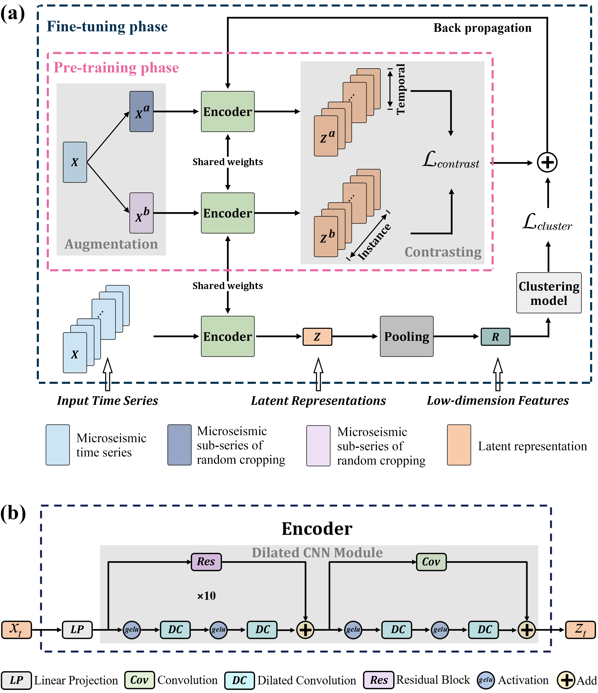
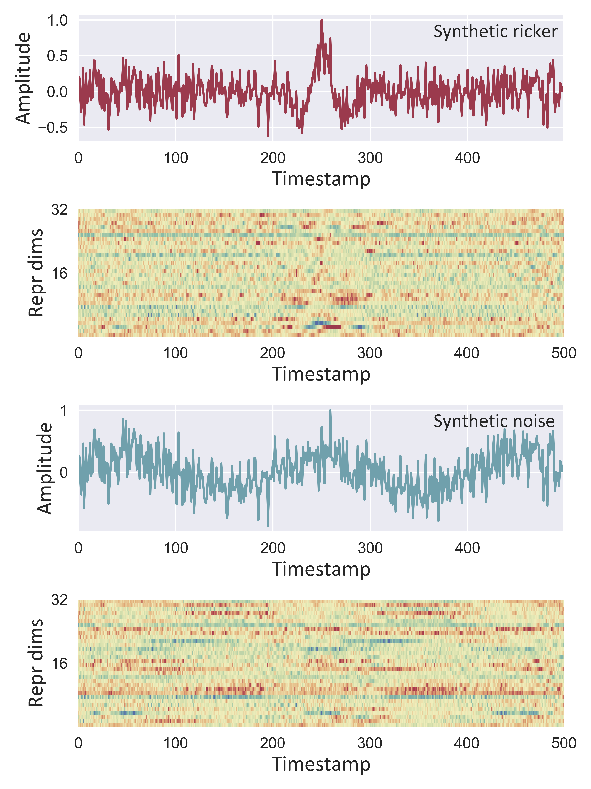

# Time Series Contrastive Clustering (TSCC)

## Getting Started

Clone the project into your local system  

```
git clone https://github.com/yangzhen-cdut/Unsupervised-Clustering.git
cd Unsupervised-Clustering
```

## Requirements
The recommended requirements for TSCC are specified as follows:
* Python 3.7
* torch==1.8.1
* scipy==1.7.3
* numpy==1.21.6
* pandas==1.3.5
* scikit_learn==0.24.2
* matplotlib==3.5.2
* bottleneck==1.3.4
* seaborn==0.11.2

The dependencies can be installed by:
```bash
pip install -r requirements.txt
```

Note that you should have CUDA installed for running the code.
## Data

Two types of datasets can be obtained from `datasets/` folder:

* [Micrseismic spectrograms] can be found in `datasets/Micrseismic_Spectrograms/` folder.
* [Micrseismic time series] can be found in `datasets/Micrseismic_Timeseries/` folder.

## Usage

To train TSCC on a microseismic dataset, run the following command:

```run
python run.py <dataset_name> <dataset_name> --pretraining_epoch <pretraining_epoch> --batch-size <batch_size> --MaxIter <MaxIter> --repr-dims <repr_dims>
```

After training, the trained encoder of pre-training phase, the trained encoder of fine-tuning phase and clustering centers can be found in `./<dataset_name>_Pretraining_phase`, `./<dataset_name>_Finetuning_phase`, `./<dataset_name>_Centers`. 

To evaluate TSCC on a microseismic dataset, run the following command:

```evaluate
python evaluation.py <dataset_name> <dataset_name> --pretraining_epoch <pretraining_epoch> --batch-size <batch_size> --MaxIter <MaxIter> --repr-dims <repr_dims>
```

There are two examples are given in `evaluation.py`: `eval_with_real_data` and `eval_with_synthetic_data`. You can call those two functions directly, and the output of representations can be found in `./Eval_Representations.npy` and `./Eval_Syn_Representations.npy`, respectively. 


## Results

### The architecture of TSCC used in our study. 



### Clustering performance comparison. 


### Visualization of learned latent representations. 

Latent representations of synthetic waveforms



Latent representations of real microseismic waveforms


### Classification performance comparison of supervised classifier using raw time series and the features (R) generated by the TSCC.

### Representative cluster distribution
Tpyical microseismic waveforms                       Tpyical noise waveforms   
<figure class="half">
    
    
</figure>


<table>
	<tr>
      <td rowspan="2">Methods</td>
	    <th colspan="3">Time series</th>
      <th colspan="3">Feature R</th>
	</tr >
	<tr >
	    <td>ACC (%)</td>
      <td>NMI (%)</td>
      <td>AUPRC (%)</td>
    	<td>ACC (%)</td>
      <td>NMI (%)</td>
      <td>AUPRC (%)</td>
	</tr>
	<tr>
	    <td>Linear</td>
      <td>71.59</td>
      <td>15.38</td>
      <td>66.47</td>
    	<td>99.11</td>
      <td>92.63</td>
      <td>98.71</td>
	</tr>
  <tr>
	    <td>KNN</td>
      <td>90.58</td>
      <td>55.55</td>
      <td>87.65</td>
    	<td>98.13</td>
      <td>86.62</td>
      <td>97.36</td>
	</tr>
  <tr>
	    <td>SVM</td>
      <td>97.65</td>
      <td>83.91</td>
      <td>99.81</td>
    	<td>98.94</td>
      <td>91.56</td>
      <td>99.91</td>
	</tr>
  <tr>
	    <td>TSCC</td>
      <td>98.07</td>
      <td>86.26</td>
      <td>97.15</td>
    	<td>--</td>
      <td>--</td>
      <td>--</td>
	</tr>
</table>
