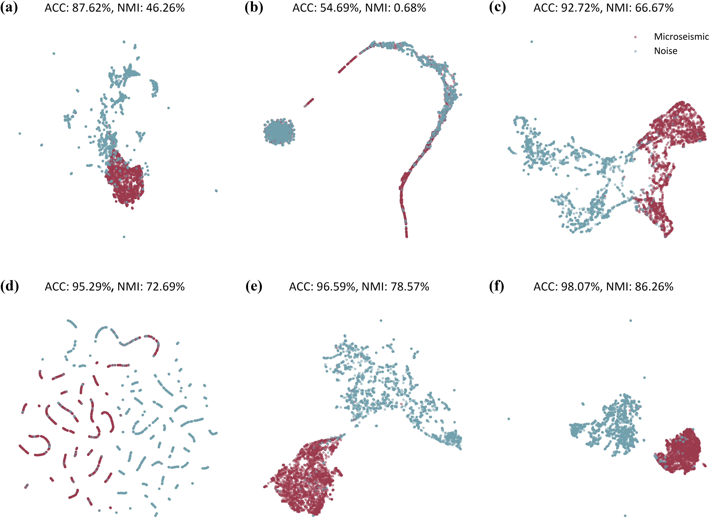

# Time Series Contrastive Clustering (TSCC): An end-to-end unsupervised clustering of microseismic signals
-------------------------------------------------------

## Requirements

The recommended requirements for TS2Vec are specified as follows:
* Python 3.7
* torch==1.8.1
* scipy==1.7.3
* numpy==1.21.6
* pandas==1.3.5
* scikit_learn==0.24.2
* matplotlib==3.5.2
* Bottleneck==1.3.4
* seaborn==0.11.2

The dependencies can be installed by:
```bash
pip install -r requirements.txt
```
## Data

Two types of datasets can be obtained from `datasets/` folder:

* [Micrseismic spectrograms] can be found in `datasets/Micrseismic_Spectrograms/` folder.
* [Micrseismic time series] can be found in `datasets/Micrseismic_Timeseries/` folder.

## Usage

* To train TSCC on a microseismic dataset, run the following command:

```run & evaluate
python run.py <dataset_name> <dataset_name> --pretraining_epoch <pretraining_epoch> --batch-size <batch_size> --MaxIter1 <MaxIter1> --repr-dims <repr_dims> --gpu <gpu> --eval
```
* To evaluate TSCC on a microseismic dataset, run the following command:

```run & evaluate
python run.py <dataset_name> <dataset_name> --pretraining_epoch <pretraining_epoch> --batch-size <batch_size> --MaxIter1 <MaxIter1> --repr-dims <repr_dims> --gpu <gpu> --eval
```

After training and evaluation, the trained encoder, output and evaluation metrics can be found in `training/DatasetName__RunName_Date_Time/`. 


## Results

### The architecture of TSCC used in our study. 


Sampel data. a) and b) are two examples of the seismograms with different polarity of first motion.
c) and d) are examples of local and teleseismic waveforms respectively while e) and f) are the associated Short-Time Fourier transforms. 
Clustering results. 

### Clustering results. 



### Visualization of learned latent representations. 

Latent representations of synthetic waveforms


Latent representations of real microseismic waveforms


### Classification performance comparison of the linear classifier, KNN, and SVM using raw time series and the features (R) generated by the proposed TSCC.

<table>
	<tr>
      <td rowspan="2">Methods</td>
	    <th colspan="3">Time series</th>
      <th colspan="3">Feature R</th>
	</tr >
	<tr >
	    <td>ACC (%)</td>
      <td>NMI (%)</td>
      <td>AUPRC (%)</td>
    	<td>ACC (%)</td>
      <td>NMI (%)</td>
      <td>AUPRC (%)</td>
	</tr>
	<tr>
	    <td>Linear</td>
      <td>71.59</td>
      <td>15.38</td>
      <td>66.47</td>
    	<td>99.11</td>
      <td>92.63</td>
      <td>98.71</td>
	</tr>
  <tr>
	    <td>KNN</td>
      <td>90.58</td>
      <td>55.55</td>
      <td>87.65</td>
    	<td>98.13</td>
      <td>86.62</td>
      <td>97.36</td>
	</tr>
  <tr>
	    <td>SVM</td>
      <td>97.65</td>
      <td>83.91</td>
      <td>99.81</td>
    	<td>98.94</td>
      <td>91.56</td>
      <td>99.91</td>
	</tr>
  <tr>
	    <td>TSCC</td>
      <td>98.07</td>
      <td>86.26</td>
      <td>97.15</td>
    	<td>--</td>
      <td>--</td>
      <td>--</td>
	</tr>
</table>
